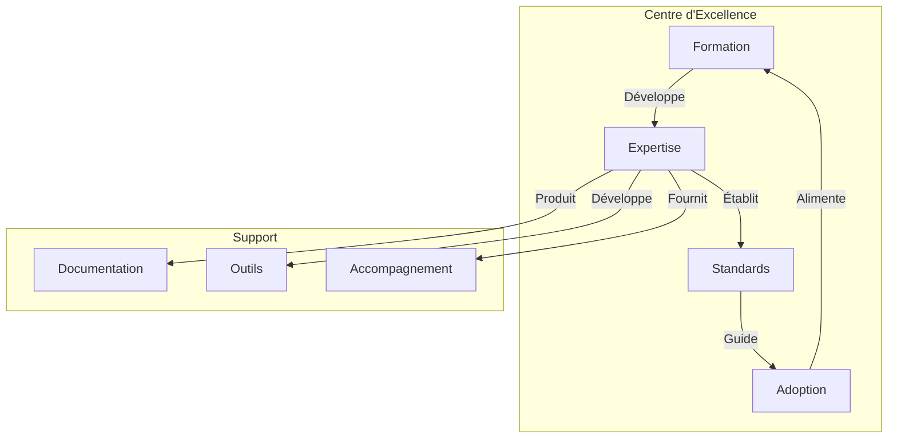

# Gouvernance et Adoption : La Clé du Succès

"Les meilleurs standards ne valent rien s'ils ne sont pas adoptés." Cette vérité, souvent négligée, est au cœur de la réussite ou de l'échec des initiatives de data contracts. La gouvernance et l'adoption ne sont pas des considérations secondaires à traiter après les aspects techniques - elles sont le fondement même d'une implémentation réussie.

## La gouvernance comme fondation

La gouvernance des data contracts doit être vue comme un cadre habilitant plutôt que comme une contrainte. Elle doit faciliter l'innovation tout en assurant la qualité et la cohérence. Voici un exemple de structure de gouvernance formalisée dans un contrat :

```yaml
dataContractSpecification: 1.1.0
id: urn:datacontract:governance:framework
info:
  title: "Data Contract Governance Framework"
  version: "1.0.0"
  description: "Governance framework for data contracts"
  owner: "data-governance-office"
  contact:
    name: "Data Governance Office"
    email: "dgo@company.com"

models:
  GovernanceModel:
    type: "object"
    description: "Data contract governance model"
    fields:
      roles:
        type: "object"
        description: "Governance roles and responsibilities"
        fields:
          data_steward:
            type: "object"
            description: "Data steward role"
            fields:
              responsibilities:
                type: "array"
                items:
                  type: "text"
                description: "Data steward responsibilities"
                example: ["quality_validation", "compliance_check"]
              qualifications:
                type: "array"
                items:
                  type: "text"
                description: "Required qualifications"
          domain_owner:
            type: "object"
            description: "Domain owner role"
            fields:
              responsibilities:
                type: "array"
                items:
                  type: "text"
                description: "Domain owner responsibilities"
      processes:
        type: "object"
        description: "Governance processes"
        fields:
          contract_approval:
            type: "object"
            description: "Contract approval process"
            fields:
              steps:
                type: "array"
                items:
                  type: "object"
                  fields:
                    name:
                      type: "text"
                    approver:
                      type: "text"
                    sla:
                      type: "text"
                      format: "duration"

terms:
  review_cycle:
    frequency: "P3M"
    participants: ["data_steward", "domain_owner", "compliance_officer"]
  
  escalation:
    levels:
      - level: 1
        handler: "domain_owner"
        responseTime: "P1D"
      - level: 2
        handler: "governance_board"
        responseTime: "P3D"

servicelevels:
  approval:
    description: "Contract approval process"
    responseTime: "P5D"
    escalationThreshold: "P7D"
```

## Le Centre d'Excellence (CoE)

Le Centre d'Excellence joue un rôle crucial dans l'adoption des data contracts. Il n'est pas qu'un centre de support - c'est un véritable catalyseur de transformation. Voici comment structurer son fonctionnement :



## Stratégie d'Adoption Progressive

L'adoption des data contracts doit suivre une approche progressive et mesurée. Voici un exemple de plan d'adoption formalisé :

```yaml
dataContractSpecification: 1.1.0
id: urn:datacontract:adoption:strategy
info:
  title: "Data Contract Adoption Strategy"
  version: "1.0.0"
  description: "Strategic framework for data contract adoption"
  owner: "transformation-office"
  contact:
    name: "Transformation Office"
    email: "transformation@company.com"

models:
  AdoptionPhases:
    type: "object"
    description: "Phased adoption strategy"
    fields:
      phase1_pilot:
        type: "object"
        description: "Pilot phase with selected domains"
        fields:
          duration: 
            type: "text"
            format: "duration"
            value: "P3M"
          success_criteria:
            type: "array"
            items:
              type: "text"
          domains:
            type: "array"
            items:
              type: "text"
            example: ["sales", "customer"]
      phase2_expansion:
        type: "object"
        description: "Controlled expansion phase"
        fields:
          duration:
            type: "text"
            format: "duration"
            value: "P6M"
          target_coverage:
            type: "integer"
            description: "Percentage of domains covered"
            minimum: 50
      phase3_standardization:
        type: "object"
        description: "Enterprise-wide standardization"
        fields:
          duration:
            type: "text"
            format: "duration"
            value: "P1Y"
          completion_criteria:
            type: "array"
            items:
              type: "text"

terms:
  success_metrics:
    adoption_rate:
      description: "Percentage of eligible domains using contracts"
      target: 80
      timeframe: "P1Y"
    quality_improvement:
      description: "Reduction in data quality incidents"
      target: 50
      timeframe: "P6M"

servicelevels:
  support:
    description: "Adoption support services"
    availability:
      business_hours: "9am-5pm"
      response_time: "P1D"
    training:
      frequency: "P1M"
      capacity: 30
```

## Mesure du Succès

Le succès de l'adoption des data contracts doit être mesuré de manière objective et continue. Les métriques clés incluent :

1. **Taux d'Adoption**
   - Nombre de domaines utilisant activement les contrats
   - Pourcentage de données critiques couvertes
   - Vitesse d'adoption par domaine

2. **Impact Business**
   - Réduction des incidents de qualité
   - Amélioration des temps de mise sur le marché
   - Satisfaction des équipes consommatrices

3. **Maturité des Pratiques**
   - Qualité des contrats produits
   - Respect des processus de gouvernance
   - Niveau d'automatisation atteint

## Formation et Accompagnement

La formation ne doit pas se limiter à des aspects techniques. Elle doit couvrir :

1. **Fondamentaux**
   - Principes des data contracts
   - Bénéfices business
   - Rôles et responsabilités

2. **Aspects Techniques**
   - Rédaction de contrats
   - Utilisation des outils
   - Validation et tests

3. **Soft Skills**
   - Communication inter-équipes
   - Gestion du changement
   - Résolution de conflits

## Conclusion

La gouvernance et l'adoption des data contracts sont indissociables de leur succès technique. Une gouvernance bien pensée crée le cadre nécessaire à l'adoption, tandis qu'une stratégie d'adoption progressive permet de construire la confiance et l'expertise nécessaires.

Le prochain article explorera comment ces principes s'appliquent dans des contextes spécifiques, avec des études de cas détaillées d'organisations ayant réussi leur transformation.